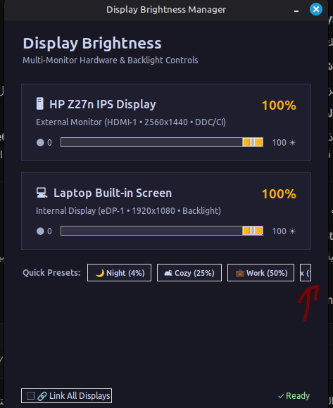

# Display Brightness Manager (Twinkle Tray for Linux) ☀️🖥️

A lightweight, modern Linux GUI utility to control multi-monitor brightness with true **DDC/CI hardware control** for external displays and native backlight control for laptop screens.

<p align="center">
  
</p>

---

## 🌟 Features
- **True Hardware DDC/CI Control:** Adjusts the physical backlight of external displays (HDMI/DisplayPort) via `ddcutil`.
- **Full 0% to 100% Freedom:** No artificial lower limits. Dim to complete zero for late-night productivity.
- **Night Light Safe:** Controls physical laptop backlight LEDs without overwriting the GPU color temperature / gamma ramp (Night Light / Redshift stays active).
- **Asynchronous & Throttled:** Commands are dispatched smoothly on a background worker thread to protect the monitor's I2C bus and prevent UI lag.
- **Quick Presets:** Instant 1-click presets for Night (4%), Cozy (25%), Work (50%), and Max (100%).
- **Link All Displays:** Synchronize all monitors simultaneously with a single slider.
- **Desktop Integration:** Includes custom vector SVG icon and `.desktop` launcher.

---

## 📋 Requirements
- Python 3 with `tkinter`
- `ddcutil` & `i2c-tools` (for external monitors)
- `brightnessctl` (for laptop hardware backlight)

Install dependencies on Ubuntu/Debian/Linux Mint:
```bash
sudo apt install -y ddcutil i2c-tools brightnessctl
sudo usermod -aG i2c $USER  # Log out and log back in afterwards
```

---

## 🚀 Installation & Usage

### One-line Automated Install:
```bash
./install.sh
```
Or directly from GitHub:
```bash
curl -sSL https://raw.githubusercontent.com/bayoumi/display-brightness-manager/main/install.sh | bash
```

### Manual Run:
```bash
python3 app.py
```

### Uninstallation:
```bash
./uninstall.sh
```

---

## 📁 Repository Structure
```text
display-brightness-manager/
├── app.py           # Main GUI application (Python 3 + Tkinter)
├── assets/
│   └── screenshot.png # App screenshot
├── icon.svg         # High-resolution vector icon
├── install.sh       # Automated installer script
├── uninstall.sh     # Clean uninstaller script
├── LICENSE          # MIT License
└── README.md        # Documentation
```

---

## ⚖️ License
MIT License © 2026 Bayoumi
